<h1>rodolfo.gg |    </h1>

This collection of repositories features software written in JavaScript, Go, Python, C, PHP, and other languages, as well as frameworks such as Yii and Svelte. Best viewed in dark mode 😎

- [🧭 Navigation Guide](#-navigation-guide)
- [🛠️ Tech Stack](#️-tech-stack)
  - [Main programming languages](#main-programming-languages)
  - [Secondary programming languages](#secondary-programming-languages)
  - [Design and markup tools](#design-and-markup-tools)
  - [Front- and back-end programming frameworks](#front--and-back-end-programming-frameworks)
  - [Systems administration](#systems-administration)
  - [Hardware](#hardware)
  - [Creativity](#creativity)
- [✨ Featured projects](#-featured-projects)
- [📊 Statistics](#-statistics)
- [🍕 Support me](#-support-me)

## 🧭 Navigation Guide

I use GitHub Topics to categorize my repositories:

* ✨ **Original projects:** Non-forked repos tagged with topics are programmed entirely by me.
* 🔧 **Contributions:** Forked repos tagged with topics feature my custom modifications.
* 📦 **Archives:** Untagged repositories are mirrored backups only.

## 🛠️ Tech Stack

### Main programming languages

### Secondary programming languages

### Design and markup tools

### Front- and back-end programming frameworks

### Systems administration

### Hardware

### Creativity

## ✨ Featured projects

[](https://github.com/rgglez/gettext-translator)
[](https://github.com/rgglez/geonames-loader)
[](https://github.com/rgglez/gormcache)
[](https://github.com/rgglez/whois-parser-ai)
[](https://github.com/rgglez/nagios-check-ssl-expiration)
[](https://github.com/rgglez/nagios-check-domain)
[](https://github.com/rgglez/gofiber-recovery-middleware)
[](https://github.com/rgglez/gofiber-recaptcha3-middleware)
[](https://github.com/rgglez/svelte-i18n-gettext)
[](https://github.com/rgglez/gettext-spellchecker)
[](https://github.com/rgglez/yii-webfeed)
[](https://github.com/rgglez/go-storage)

## 📊 Statistics

<!--  -->
<!--  -->

## 🍕 Support me

